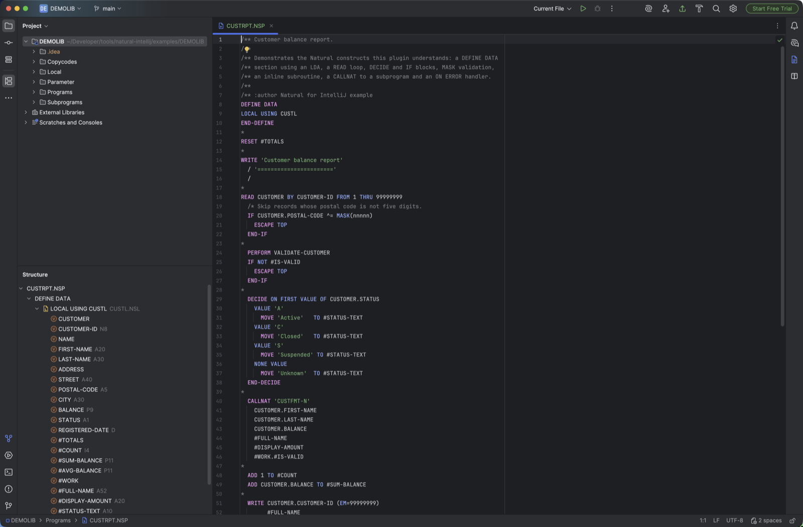
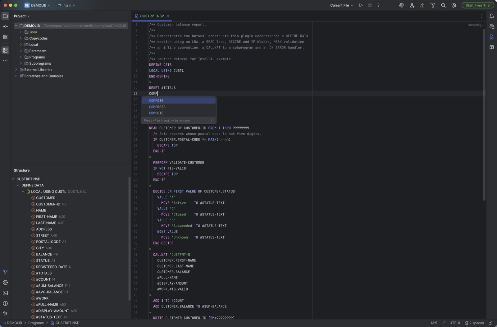
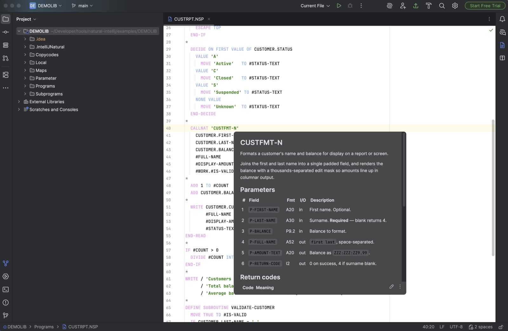
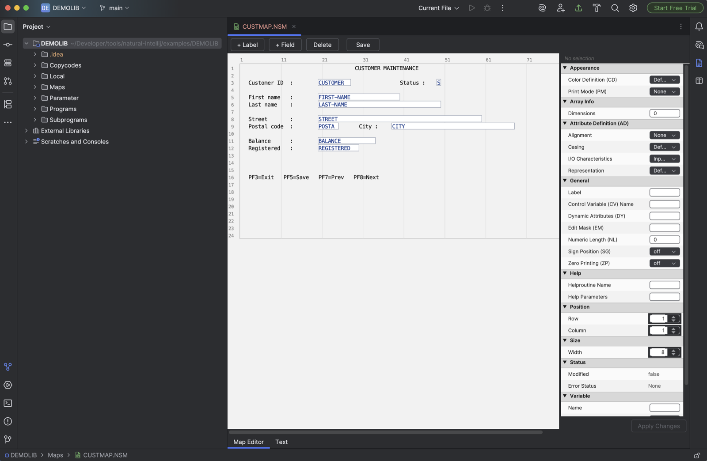

<div align="center">


# Natural for IntelliJ

**IDE support for Software AG's Natural programming language**

[](https://github.com/Johannett321/natural-intellij/releases/latest)
[](https://www.jetbrains.com/idea/)
[](https://openjdk.org/projects/jdk/21/)
[](LICENSE)

*Modern IDE productivity for a 1979 mainframe language.*

</div>

---

<!-- Plugin description -->

## Overview

Natural is a fourth-generation language from Software AG, still running core business systems
on mainframe and midrange platforms across banking, insurance and government. The tooling that
ships with it is dated, and most Natural developers work without the conveniences the rest of
the industry takes for granted.

This plugin brings Natural into IntelliJ IDEA: a real lexer and parser, a PSI model, and the
navigation, completion and refactoring features that model gives you — plus an optional
integration with Natural Development Servers for browsing, compiling and debugging remote objects.

It is free and open source, with no telemetry, no accounts and no paid tier.

## Project status — please read

**This is a community side project, not a finished product.** Plenty of things do not work yet.
There are bugs, there are missing features, and there are corners of the Natural language the
grammar does not cover. The goal was never perfection — it was *good enough to be genuinely
useful*, which it already is for everyday work.

It is also not anyone's main priority, so progress comes in bursts. **That makes contributions
very welcome** — especially reports of Natural code the parser gets wrong, which are the single
most useful thing you can send.

If you are evaluating this for a team: expect a helpful tool with rough edges, not a replacement
for a supported vendor product.

## Features

| | Feature | What it does |
|---|---|---|
| 🎨 | **Syntax highlighting** | Token-level highlighting driven by a real JFlex lexer, not regular expressions. Configurable colour scheme under *Settings → Editor → Color Scheme → Natural*. |
| 🔡 | **Code completion** | Context-aware completion for statements, `DEFINE DATA` clauses, session parameters, system variables and every variable in scope. |
| 🖱️ | **Go to declaration** | Ctrl/Cmd+Click a variable, subroutine, `CALLNAT` target or data area to jump to its definition — across files and libraries. |
| 🔍 | **Find usages** | Every reference to a variable, subroutine or module, including uses of a data area from other objects. |
| ✏️ | **Rename refactoring** | Rename variables and subroutines with all references updated. |
| 📖 | **Documentation** | Hover for statement reference and doc comments; a NaturalDoc panel renders the `/**` header of the current object. |
| 📐 | **Code folding** | Collapse `IF`, `FOR`, `REPEAT`, `DECIDE`, `READ`, `FIND`, `ON ERROR`, subroutines and the `DEFINE DATA` section. |
| 🗂️ | **Structure view** | Outline of data areas, variables and subroutines for the current object. |
| 🧭 | **Dependency view** | Which objects call this one, and which ones it calls. |
| 🏷️ | **Nicknames** | Attach a readable alias to cryptic 8-character object names; shown in the project tree, editor tabs and Search Everywhere. |
| 🖼️ | **Map editor** | Visual editor for `.NSM` screen maps alongside the source view. |
| 💡 | **Intentions** | Generate a missing variable declaration or subroutine; extract a selection into a subroutine or subprogram. |
| ▶️ | **Run configurations** | Run Natural objects through a local `natural` executable in an embedded terminal. |
| 🌐 | **Server integration** | Browse Natural Development Servers, open remote objects, stow/check against the server, diff local against remote, and debug remotely with breakpoints. *(Optional — see below.)* |

## Supported file types

| Extension | Object type | | Extension | Object type |
|---|---|---|---|---|
| `.NSP` | Program | | `.NSM` | Map |
| `.NSN` | Subprogram | | `.NSG` | Global data area |
| `.NSS` | External subroutine | | `.NSL` | Local data area |
| `.NSC` | Copycode | | `.NPD` | Parameter data area |
| `.NSD` | Data definition module | | `.NST` | Text |

## Language coverage

<details>
<summary><b>Data movement and arithmetic</b></summary>

`MOVE` (with `ROUNDED`, `BY NAME`, `BY POSITION`, `LEFT`/`RIGHT JUSTIFIED`, `NORMALIZED`,
`ENCODED`, `EDITED`, `ALL`), `ASSIGN`, `COMPUTE`, `ADD`, `SUBTRACT`, `MULTIPLY`, `DIVIDE`,
`COMPRESS`, `SEPARATE`, `EXAMINE`, `RESET`, `TRANSLATE`

</details>

<details>
<summary><b>Control flow</b></summary>

`IF`/`ELSE`/`END-IF`, `FOR`/`END-FOR`, `REPEAT`/`END-REPEAT` (with `WHILE`/`UNTIL`),
`DECIDE ON`, `DECIDE FOR`, `ESCAPE` (`TOP`/`BOTTOM`/`ROUTINE`/`MODULE`), `STOP`,
`TERMINATE`, `FETCH`, statement labels

</details>

<details>
<summary><b>Database access</b></summary>

`READ`/`END-READ`, `FIND`/`END-FIND`, `GET`, `HISTOGRAM`, `STORE`, `UPDATE`, `DELETE`,
`END-TRANSACTION`, `BACKOUT`, `PASSWORD`/`CIPHER` clauses, `WITH` and `WHERE` conditions,
`AT BREAK`, `AT START OF DATA`, `AT END OF DATA`

</details>

<details>
<summary><b>Input and output</b></summary>

`WRITE`, `DISPLAY`, `PRINT`, `INPUT`, `REINPUT`, `WRITE WORK FILE`, `READ WORK FILE`,
`DEFINE WINDOW`, `DEFINE PRINTER`, `SET CONTROL`, `AT TOP OF PAGE`, `AT END OF PAGE`,
`FORMAT`, session parameters and edit masks

</details>

<details>
<summary><b>Modularisation</b></summary>

`PERFORM`, `DEFINE SUBROUTINE`/`END-SUBROUTINE`, `CALLNAT`, `CALL`, `RUN`, `INCLUDE`,
`DEFINE DATA` with `LOCAL`/`GLOBAL`/`PARAMETER`/`INDEPENDENT` and `USING` clauses

</details>

<details>
<summary><b>Error handling and conditions</b></summary>

`ON ERROR`/`END-ERROR`, comparison operators (`=`, `EQ`, `^=`, `NE`, `<`, `LT`, `>`, `GT`,
`<=`, `LE`, `>=`, `GE`), `AND`/`OR`/`NOT`, `MASK(...)` pattern matching, `SCAN`,
right-hand-side shorthand (`IF A = '11' OR = '19'`), system variables (`*ERROR-NR`, `*PROGRAM`, …)

</details>

## A taste of Natural

```natural
DEFINE DATA
LOCAL USING CUSTL
END-DEFINE

READ CUSTOMER BY CUSTOMER-ID FROM 1 THRU 99999999
  /* Skip records whose postal code is not five digits.
  IF CUSTOMER.POSTAL-CODE ^= MASK(nnnnn)
    ESCAPE TOP
  END-IF

  DECIDE ON FIRST VALUE OF CUSTOMER.STATUS
    VALUE 'A'   MOVE 'Active'    TO #STATUS-TEXT
    VALUE 'C'   MOVE 'Closed'    TO #STATUS-TEXT
    NONE VALUE  MOVE 'Unknown'   TO #STATUS-TEXT
  END-DECIDE

  MOVE EDITED CUSTOMER.BALANCE (EM=ZZZ:ZZZ:ZZ9.99) TO #DISPLAY-AMOUNT
  WRITE CUSTOMER.CUSTOMER-ID (EM=99999999) #FULL-NAME #DISPLAY-AMOUNT
END-READ
```

A complete, self-contained example library lives in [`examples/DEMOLIB`](examples/DEMOLIB) —
a program, a subprogram, a copycode, a screen map, a local data area and a parameter data area
that between them exercise most of the grammar. It also carries a NaturalDoc file for the
subprogram, so hover documentation works as soon as you open it.

Official language reference: <https://documentation.softwareag.com/natural/nat921unx/webhelp/natux-webhelp/>

<!-- Plugin description end -->

---

## Screenshots

**Syntax highlighting and structure view.** The outline resolves `LOCAL USING CUSTL` into the
local data area and lists every field with its Natural type, so a program's data model is
readable without opening the LDA.



**Code completion.** Statement keywords, `DEFINE DATA` clauses, session parameters, system
variables and every variable in scope.



**Documentation on hover.** Hovering a `CALLNAT` target resolves the subprogram and renders its
NaturalDoc — a Markdown file kept alongside the library — so a module's parameters and return
codes are one hover away instead of a file away. Data areas and copycodes work the same way.



**Map editor.** `.NSM` screen maps open in a visual editor on the real 80×24 terminal grid, with a
properties panel for Natural session parameters — attribute definition, edit mask, control
variable, helproutine — and a `Text` tab for editing the source directly.



---

## Installing

### From a release

1. Download `natural-intellij-<version>.zip` from the
   [latest release](https://github.com/Johannett321/natural-intellij/releases/latest).
2. In IntelliJ IDEA: **Settings → Plugins → ⚙ → Install Plugin from Disk…**
3. Select the ZIP and restart the IDE.

Requires IntelliJ IDEA **2025.2** or newer (Community or Ultimate).

### From source

```bash
git clone https://github.com/Johannett321/natural-intellij.git
cd natural-intellij
./gradlew buildPlugin
# -> build/distributions/natural-intellij-<version>.zip
```

---

## Building

**Requires JDK 21.**

```bash
./gradlew runIde                 # launch a sandboxed IDE with the plugin loaded
./gradlew runIde -PopenSample    # ...and open examples/DEMOLIB in it
./gradlew buildPlugin            # build the distributable ZIP
./gradlew test                   # run the test suite
./gradlew verifyPlugin           # check compatibility with the target platform
./gradlew check                  # tests plus Kover coverage report
```

Run configurations for each of these live in [`.run/`](.run) and work directly from IntelliJ.

### Regenerating the lexer and parser

The grammar lives in two source files; everything under `src/main/gen/` is generated from them
and must never be edited by hand.

| Source | Generates | How |
|---|---|---|
| [`src/main/flex/Natural.flex`](src/main/flex/Natural.flex) | `_NaturalLexer` | `./gradlew generateLexer`, or right-click → *Run JFlex Generator* |
| [`src/main/bnf/Natural.bnf`](src/main/bnf/Natural.bnf) | Parser + 150+ PSI classes | `./gradlew generateParser`, or right-click → *Generate Parser Code* |

Both run automatically before `compileKotlin`.

### Building with NDV server support

The server features — object browsing, stow/check, remote debugging and diffing against the
server — talk to the Natural Development Server through Software AG's **NaturalONE client
libraries**. Those libraries are proprietary and are **not** redistributed with this project,
so a default build omits the server module entirely and produces core language support only.

If you have a licensed NaturalONE installation, build with it:

```bash
./gradlew buildPlugin -PnaturalOneLibDir=/path/to/NaturalOne/Designer/eclipse/plugins
```

or copy the three jars into `libs/` (git-ignored) and build normally:

```
com.softwareag.naturalone.natural.ndvserveraccess_*.jar
com.softwareag.naturalone.natural.auxiliary_*.jar
com.softwareag.natural.tools_*.jar
```

Gradle prints which mode it selected:

```
Natural: NDV server support ENABLED (3 client jar(s) from …/libs)
Natural: NDV server support DISABLED - building core language support only.
```

Pass `-PndvEnabled=false` to force a core-only build even when the jars are present. The
server code lives in [`src/ndv/`](src/ndv) and registers its extensions through an optional
descriptor, so a core-only build has no dangling references. Details in
[`docs/ndv-integration.md`](docs/ndv-integration.md).

> **Please do not redistribute builds that bundle the Software AG libraries.** The published
> releases of this plugin are always core-only.

---

## Documentation

| Document | Contents |
|---|---|
| [`docs/architecture.md`](docs/architecture.md) | How the plugin is put together: lexer, parser, PSI, indexes, and where each IDE feature is implemented. |
| [`docs/grammar.md`](docs/grammar.md) | Working on the grammar: adding keywords and statements, alternative ordering, `pin`, lookahead guards, and the pitfalls that bite. |
| [`docs/ndv-integration.md`](docs/ndv-integration.md) | The Natural Development Server integration and how the optional module is wired. |
| [`CONTRIBUTING.md`](CONTRIBUTING.md) | Development setup, conventions, and how to report a parse failure. |
| [`CHANGELOG.md`](CHANGELOG.md) | Release history. |

---

## Contributing

Contributions are very welcome — particularly grammar fixes. Natural has a large surface and
plenty of dialect variation, so **parse failures on real code are the most useful thing you can
report**. See [`CONTRIBUTING.md`](CONTRIBUTING.md) for how to file one with a minimal
reproduction (and without pasting anything proprietary).

## Disclaimers

**Not a commercial project, and not monetising anyone else's product.** There is no paid tier, no
licence to buy, no donations, no ads and no telemetry. Nobody is making money from this, and there
is no attempt to profit from Software AG's products or brand. It exists for one reason: Natural
developers deserve the same tooling everyone else has. A lot of Natural code is maintained by
people who joined the industry with modern editors, and asking them to give that up is a real
barrier — both to their productivity and to the long-term maintainability of these systems. This
is a community effort to close some of that gap.

**Maturity.** As set out under [Project status](#project-status--please-read): expect bugs,
missing features and incomplete grammar coverage. Please report what breaks rather than assuming
it is meant to be that way.

**Built largely with AI assistance.** Most of this plugin — the grammar, the PSI model, the IDE
integrations and much of this documentation — was written with substantial help from AI coding
tools, with human direction and review. It is mentioned because it is relevant when you read the
code: it is reviewed and it works, but it was not hand-written line by line, and that is worth
knowing before you rely on any particular part of it.

**No warranty.** Provided as-is under the Apache License 2.0. Verify anything it tells you about
your own source before acting on it, particularly where it writes to a Natural Development Server.

## Licence and third-party code

This project is licensed under the [Apache License 2.0](LICENSE). Third-party components and
trademark notes are listed in [`NOTICE`](NOTICE).

Natural, NaturalONE and Software AG are trademarks of their respective owners. This is an
independent, unaffiliated project and is not endorsed by, affiliated with, or supported by
Software AG or IBM.
